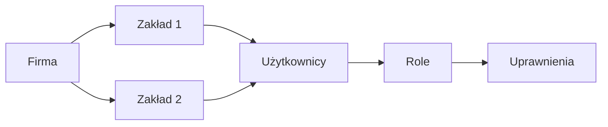
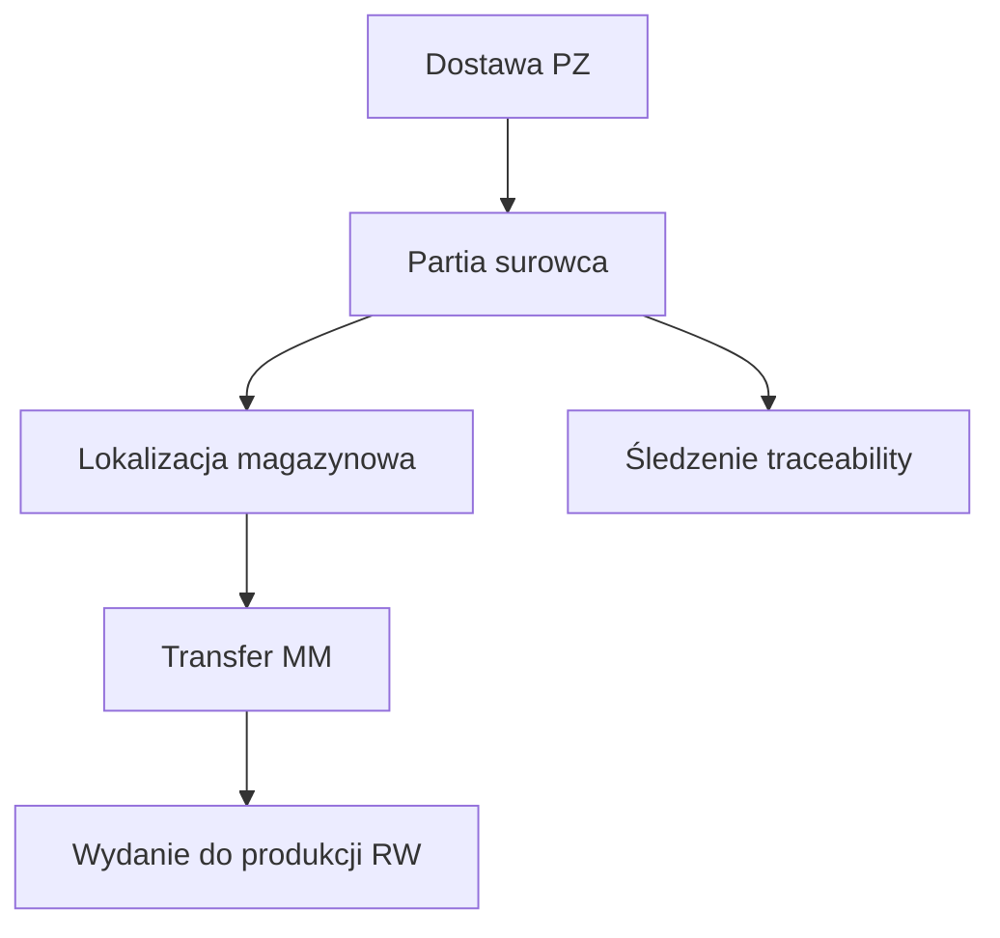
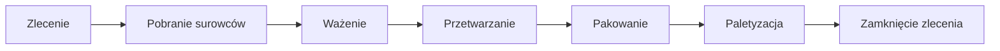
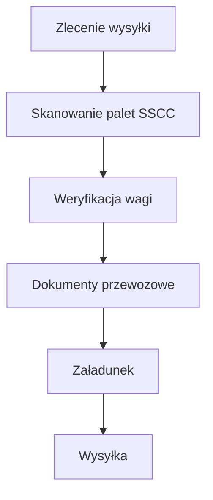
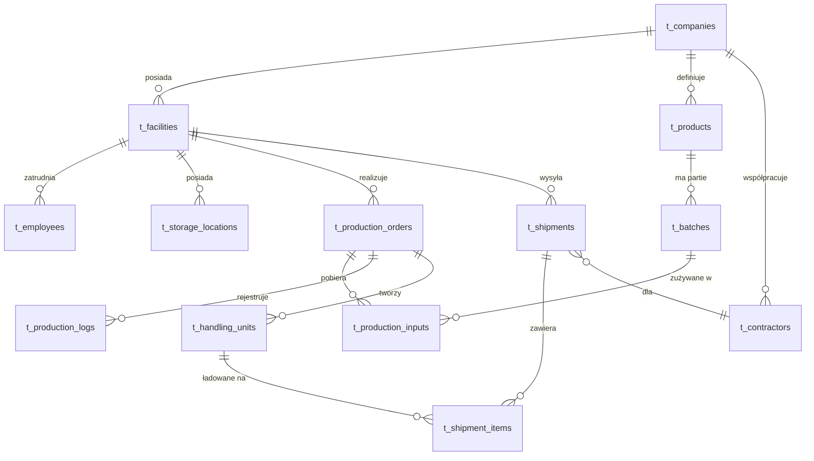
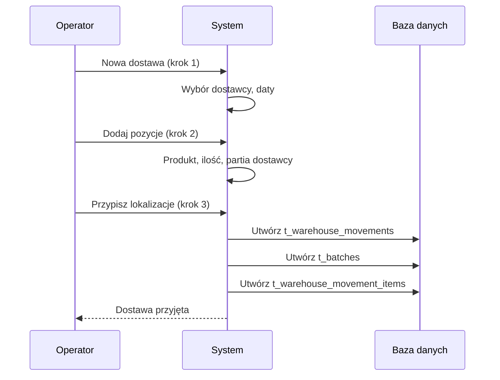
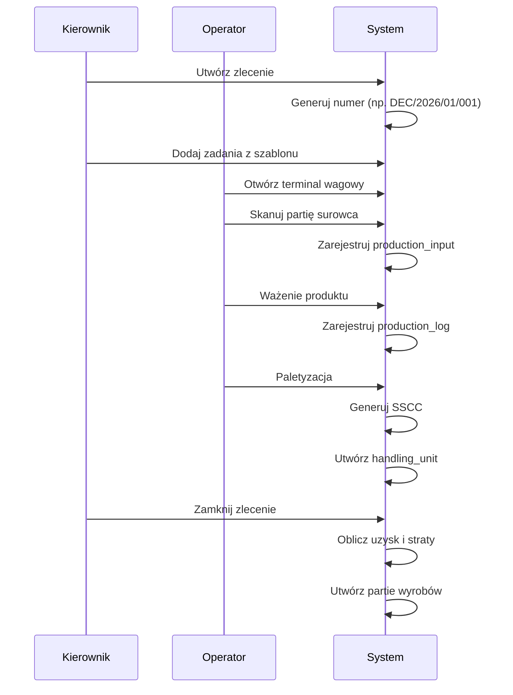
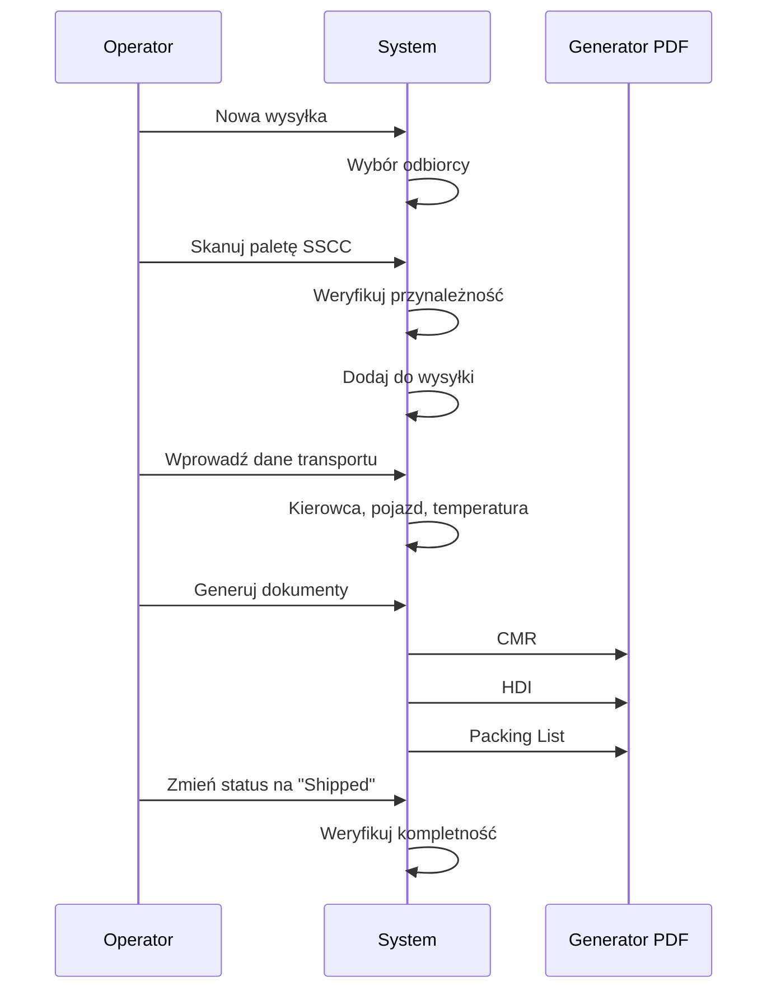

# NARROW ERP - Architektura Systemu

> Dokumentacja techniczna systemu MES/WMS dla produkcji spożywczej  
> Wersja: 1.0 | Data: 2026-01-23

---

## 1. Przegląd Projektu

### 1.1 Opis systemu

**NARROW** to zintegrowany system ERP klasy MES/WMS zaprojektowany dla przemysłu spożywczego. System obsługuje pełen cykl produkcyjny od przyjęcia surowców, przez produkcję, aż po wysyłkę gotowych produktów.

### 1.2 Kluczowe cechy

- **Architektura multi-tenant** - obsługa wielu firm i zakładów produkcyjnych
- **Pełna traceability** - śledzenie partii od dostawcy do klienta końcowego
- **Terminale produkcyjne** - dedykowane UI dla operatorów (wagi, tumblerów)
- **Generowanie dokumentów** - CMR, HDI, listy pakowania w PDF
- **System uprawnień RBAC** - granularne uprawnienia per moduł

### 1.3 Język interfejsu

Cały interfejs użytkownika jest w języku **polskim**.

---

## 2. Statystyki Projektu

### 2.1 Podsumowanie kodu

| Kategoria | Ilość |
|-----------|-------|
| **Łączna liczba linii kodu** | ~26,000 (TS/React) + ~2,000 (SQL) |
| **Pliki źródłowe** | ~207 |
| **Strony (pages)** | 30 |
| **Komponenty UI** | 65+ |
| **Hooki biznesowe** | 26 |
| **Migracje SQL** | 22 |
| **Komponenty shadcn/ui** | 45 |

### 2.2 Struktura plików

```
src/
├── pages/           # 30 stron aplikacji
│   ├── auth/        # Autoryzacja
│   ├── companies/   # Firmy
│   ├── employees/   # Pracownicy
│   ├── facilities/  # Zakłady
│   ├── production/  # Produkcja (6 stron)
│   ├── products/    # Produkty
│   ├── settings/    # Ustawienia (9 stron)
│   ├── shipping/    # Wysyłki
│   └── warehouse/   # Magazyn (6 stron)
├── components/      # Komponenty
│   ├── ui/          # 45 komponentów shadcn
│   ├── production/  # Komponenty produkcyjne
│   ├── shipping/    # Dokumenty PDF
│   └── warehouse/   # Etykiety partii
├── hooks/           # 26 hooków biznesowych
├── layouts/         # Layout dashboardu
└── integrations/    # Klient Supabase
```

---

## 3. Stack Technologiczny

### 3.1 Frontend

| Technologia | Wersja | Zastosowanie |
|-------------|--------|--------------|
| React | 18.3 | Framework UI |
| Vite | 5.x | Bundler / Dev server |
| TypeScript | 5.x | Typowanie statyczne |
| Tailwind CSS | 3.x | Stylowanie |
| shadcn/ui | latest | Komponenty UI |
| TanStack Query | 5.x | Zarządzanie stanem serwera |
| React Router | 6.x | Routing |
| React Hook Form | 7.x | Formularze |
| Zod | 3.x | Walidacja schematów |

### 3.2 Backend (Lovable Cloud)

| Komponent | Technologia |
|-----------|-------------|
| Baza danych | PostgreSQL 15 |
| Autoryzacja | Supabase Auth |
| API | Supabase PostgREST |
| Realtime | Supabase Realtime |
| Edge Functions | Deno |

### 3.3 Biblioteki dodatkowe

| Biblioteka | Zastosowanie |
|------------|--------------|
| @react-pdf/renderer | Generowanie PDF |
| recharts | Wykresy i analityka |
| date-fns | Obsługa dat |
| lucide-react | Ikony |
| qrcode.react | Generowanie kodów QR |
| sonner | Powiadomienia toast |

---

## 4. Moduły Systemu

### 4.1 CORE & IAM (Zarządzanie dostępem)

**Tabele:** `t_companies`, `t_facilities`, `t_app_users`, `t_user_roles`, `t_role_permissions`



**Role systemowe:**
- `global_admin` - pełny dostęp do wszystkich zasobów
- `facility_admin` - zarządzanie przypisanym zakładem
- `operator` - operacje produkcyjne i magazynowe
- `viewer` - tylko odczyt

**Matryca uprawnień:**
- 12 zasobów (companies, facilities, products, batches, orders...)
- 4 akcje CRUD per zasób
- Konfiguracja per rola

### 4.2 HR & Staffing (Kadry)

**Tabele:** `t_employees`, `t_job_positions`

**Funkcjonalności:**
- Rejestr pracowników z przypisaniem do zakładu
- Stanowiska pracy (np. operator wagi, kierownik zmiany)
- Logowanie przez kod QR (planowane)
- Śledzenie kto wykonał operację

### 4.3 WMS (Warehouse Management)

**Tabele:** `t_batches`, `t_warehouse_movements`, `t_warehouse_movement_items`, `t_storage_locations`, `t_packaging_balances`



**Typy dokumentów magazynowych:**
- `PZ` - Przyjęcie zewnętrzne (dostawy)
- `WZ` - Wydanie zewnętrzne (wysyłki)
- `MM` - Przesunięcie międzymagazynowe
- `RW` - Rozchód wewnętrzny (do produkcji)
- `PW` - Przyjęcie wewnętrzne (z produkcji)

**Lokalizacje magazynowe:**
- `chiller` - Chłodnia (0-4°C)
- `freezer` - Mroźnia (-18°C)
- `shock` - Szok termiczny
- `production` - Hala produkcyjna
- `storage` - Magazyn suchy

### 4.4 MES (Manufacturing Execution)

**Tabele:** `t_production_orders`, `t_production_inputs`, `t_production_logs`, `t_production_tasks`, `t_recipes`, `t_recipe_ingredients`



**Typy zleceń produkcyjnych:**
- `Decomposition` - Rozkład (np. rozbiór mięsa)
- `Processing` - Przetwarzanie (np. marynowanie)
- `Packing` - Pakowanie

**Statusy zleceń:**
- `Open` - W trakcie realizacji
- `Closed` - Zamknięte (z rozliczeniem)
- `Cancelled` - Anulowane

**Terminale produkcyjne:**
- Terminal wagowy (`/production/terminal`) - ważenie surowców
- Terminal tumblera (`/production/tumbler`) - proces marynowania
- Paletyzacja (`/production/palletization`) - tworzenie palet SSCC

### 4.5 Logistics (Wysyłki)

**Tabele:** `t_shipments`, `t_shipment_items`, `t_handling_units`, `t_contractors`



**Generowane dokumenty PDF:**
- **CMR** - Międzynarodowy list przewozowy
- **HDI** - Dokument handlowy
- **Packing List** - Lista pakowania

**Obsługa opakowań zwrotnych:**
- Saldo opakowań per kontrahent
- Transakcje wydania/przyjęcia

### 4.6 BI & Analytics

**Komponenty:** `ProductionFlowChart`, `ProductionFlowKPIs`, `ProductionFlowTable`

**Metryki:**
- Przepływ produkcji (Sankey diagram)
- Wydajność (uzysk vs straty)
- Zużycie surowców
- Statystyki per pracownik

---

## 5. Schemat Bazy Danych

### 5.1 Lista tabel (28)

| Tabela | Opis | Kluczowe pola |
|--------|------|---------------|
| `t_companies` | Firmy | name, nip, address |
| `t_facilities` | Zakłady produkcyjne | company_id, name, address |
| `t_app_users` | Użytkownicy aplikacji | id, full_name, ui_theme |
| `t_user_roles` | Role użytkowników | user_id, role, company_id, facility_id |
| `t_role_permissions` | Uprawnienia ról | role, resource, can_* |
| `t_employees` | Pracownicy | facility_id, first_name, last_name |
| `t_job_positions` | Stanowiska pracy | company_id, name |
| `t_products` | Produkty | company_id, name, sku, unit |
| `t_batches` | Partie magazynowe | product_id, batch_number, quantity |
| `t_storage_locations` | Lokalizacje | facility_id, name, location_type |
| `t_contractors` | Kontrahenci | company_id, name, type |
| `t_warehouse_movements` | Dokumenty magazynowe | doc_type, status, contractor_id |
| `t_warehouse_movement_items` | Pozycje dokumentów | movement_id, product_id, batch_id |
| `t_production_orders` | Zlecenia produkcyjne | facility_id, order_type, status |
| `t_production_inputs` | Surowce do zlecenia | order_id, batch_id, quantity |
| `t_production_logs` | Logi produkcyjne | order_id, handling_unit_id, weight |
| `t_production_tasks` | Zadania produkcyjne | order_id, name, is_completed |
| `t_handling_units` | Jednostki ładunkowe (SSCC) | sscc_code, production_order_id |
| `t_recipes` | Receptury | company_id, product_id, name |
| `t_recipe_ingredients` | Składniki receptur | recipe_id, product_id, ratio |
| `t_shipments` | Wysyłki | facility_id, contractor_id, status |
| `t_shipment_items` | Pozycje wysyłki | shipment_id, handling_unit_id |
| `t_packaging_types` | Typy opakowań | company_id, name, code |
| `t_packaging_balances` | Salda opakowań | contractor_id, packaging_type_id |
| `t_packaging_transactions` | Transakcje opakowań | balance_id, quantity, type |
| `t_units_of_measure` | Jednostki miary | company_id, code, symbol |
| `t_task_templates` | Szablony zadań | company_id, production_type, name |
| `t_devices` | Urządzenia | facility_id, name, device_type |

### 5.2 Diagram ERD (uproszczony)



### 5.3 Polityki RLS (Row Level Security)

System używa funkcji pomocniczej `is_authenticated()` która weryfikuje czy użytkownik jest zalogowany:

```sql
CREATE OR REPLACE FUNCTION public.is_authenticated()
RETURNS boolean AS $$
BEGIN
  RETURN auth.uid() IS NOT NULL;
END;
$$ LANGUAGE plpgsql SECURITY DEFINER;
```

Wszystkie tabele mają włączone RLS z politykami bazującymi na tej funkcji.

**Przykładowa polityka:**
```sql
CREATE POLICY "Authenticated users can read"
ON public.t_companies
FOR SELECT
USING (is_authenticated());
```

---

## 6. Kluczowe Przepływy Biznesowe

### 6.1 Przyjęcie dostawy (PZ)



### 6.2 Zlecenie produkcyjne



### 6.3 Wysyłka (WZ)



---

## 7. Bezpieczeństwo

### 7.1 Autoryzacja

- Logowanie przez email/hasło (Supabase Auth)
- Auto-confirm email (dla uproszczenia w fazie rozwoju)
- Sesje zarządzane przez Supabase

### 7.2 Kontrola dostępu

- **RLS na poziomie bazy** - każde zapytanie weryfikowane
- **Sprawdzanie uprawnień w UI** - hook `usePermissions()`
- **Matryca CRUD** - konfigurowana per rola

### 7.3 Walidacja danych

- **Zod** - walidacja formularzy po stronie klienta
- **Constrainty DB** - unique, foreign keys, not null
- **Triggery** - automatyczna aktualizacja `updated_at`

---

## 8. Roadmapa

### 8.1 Faza 1 (Zrealizowana) ✅

- [x] Struktura firm i zakładów
- [x] Zarządzanie użytkownikami i rolami
- [x] Katalog produktów
- [x] Przyjęcia magazynowe (PZ)
- [x] Partie i traceability
- [x] Zlecenia produkcyjne
- [x] Terminale produkcyjne
- [x] Wysyłki z dokumentami PDF
- [x] System uprawnień RBAC

### 8.2 Faza 2 (Planowana)

- [ ] Integracja z wagami elektronicznymi (WebSocket)
- [ ] Integracja z Subiekt GT
- [ ] Dashboard z KPI w czasie rzeczywistym
- [ ] Powiadomienia o krytycznych zdarzeniach
- [ ] Eksport raportów do Excel
- [ ] Logowanie pracowników przez QR

### 8.3 Faza 3 (Przyszłość)

- [ ] Aplikacja mobilna dla magazynierów
- [ ] Integracja z systemami kurierskimi
- [ ] Predykcja terminów ważności (ML)
- [ ] Optymalizacja tras dostaw

---

## 9. Konwencje Kodowania

### 9.1 Nazewnictwo

| Element | Konwencja | Przykład |
|---------|-----------|----------|
| Tabele DB | `t_` prefix, snake_case | `t_production_orders` |
| Komponenty | PascalCase | `ProductionFlowChart` |
| Hooki | camelCase z `use` prefix | `useProductionOrders` |
| Strony | PascalCase + `Page` suffix | `CompaniesPage` |
| Typy | PascalCase | `ProductionOrder` |

### 9.2 Struktura hooków

```typescript
// Każdy hook eksportuje:
export interface Entity { ... }           // Typ danych
export interface EntityFormData { ... }   // Typ formularza
export function useEntities() { ... }     // Lista
export function useEntity(id) { ... }     // Szczegóły
export function useCreateEntity() { ... } // Tworzenie
export function useUpdateEntity() { ... } // Aktualizacja
export function useDeleteEntity() { ... } // Usuwanie
```

### 9.3 Obsługa błędów

- Toast `sonner` dla powiadomień użytkownika
- `try/catch` w mutacjach
- Walidacja Zod przed wysłaniem

---

## 10. Uruchomienie projektu

```bash
# Instalacja zależności
npm install

# Uruchomienie dev server
npm run dev

# Build produkcyjny
npm run build

# Testy
npm run test
```

---

*Dokument wygenerowany automatycznie przez system NARROW ERP*
